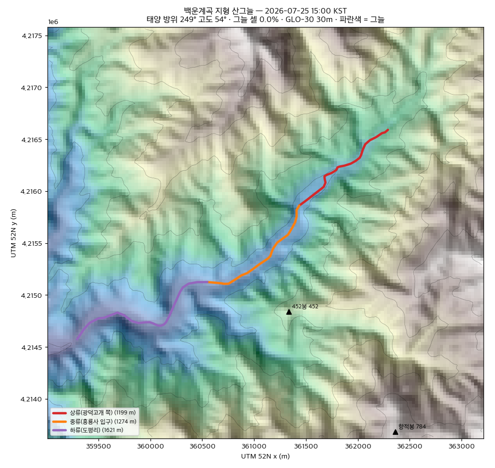
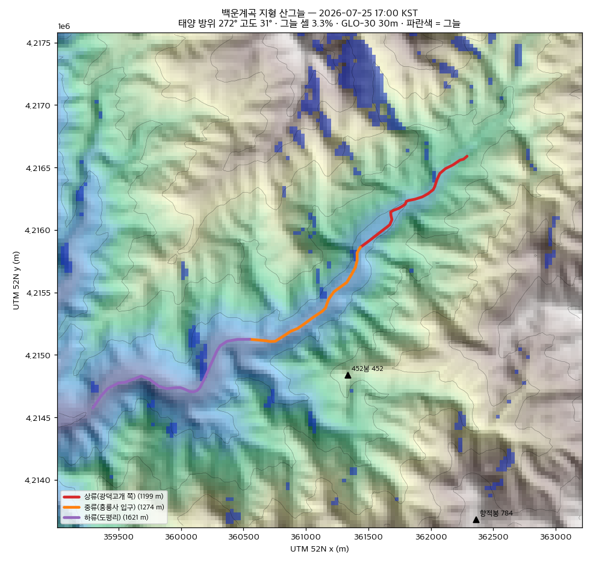
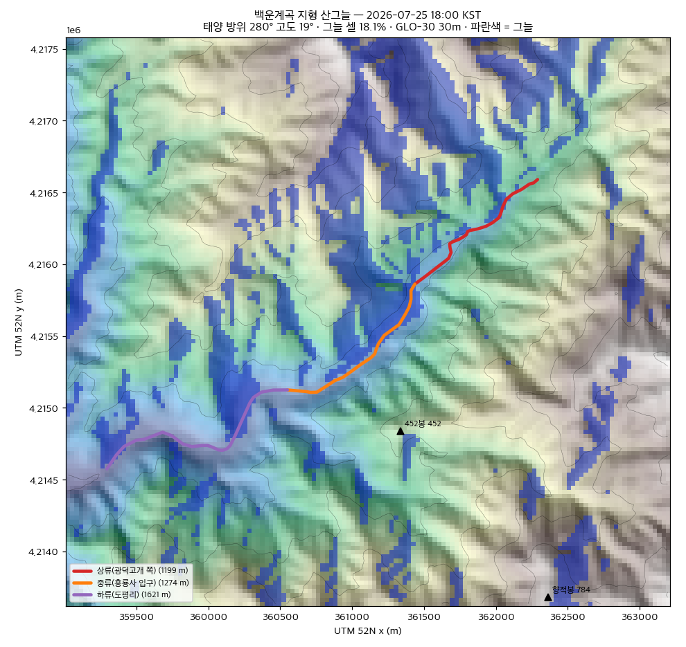
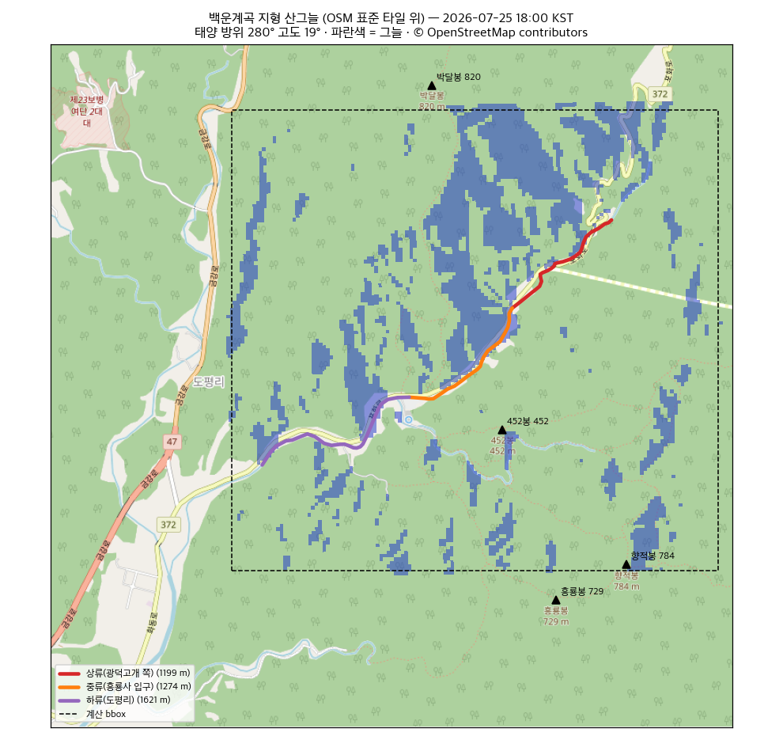

# R3b — 그늘 시험 계산 (포천 백운계곡, 지형만)

> **R3c(지형 30 m + 수관 1 m CHM)** 는 같은 환경·구간을 재사용해 `canopy/` 에 있다 → [canopy/README.md](canopy/README.md). 아래 R3b 의 스키마 권고(수기 태그)는 D6 에서 불채택됐다.

`docs/TODO.md` **R3b** 의 1차 시험. 계곡 1개에 대해 **태양 위치 × 지형(DEM)** 만으로 "산그늘이 언제부터 드는가"를
계산하고, 그 결과를 스키마 필드 `shadeOnsetLocal: 'HH:mm'` 로 쓸 만한지 판정한다. 나무 그늘(1m CHM)은 범위 밖.
연구 스크립트이며 앱 코드가 아니다 — biome/tsc/vitest 는 `scripts/research` 를 보지 않는다(`biome.json` 제외 항목).

## 판정 요약

**지형만의 `shadeOnsetLocal` 은 구간(Segment) 필드로 채택하지 않는다.** 세 구간 모두 산그늘이 18:00~18:30(일몰 ~19:35 의
70~90분 전)에야 들고, 구간 간 차이(≤ 20분)가 30m 격자 1셀 이동에 따른 흔들림(10~50분)보다 작다. 정오~15시 지형 그늘은
정확히 0% — "정오 그늘은 나무 그늘" 이라는 방향 조정의 전제가 확인됐다. 그늘 **방향** 은 능선과 맞으므로 시각화(폴리곤)
자체는 쓸 수 있지만, 구간을 변별하는 숫자로는 못 쓴다. 스키마 권고는 [맨 아래](#스키마-권고).

| 기준 | 결과 | 판정 |
| --- | --- | --- |
| ① 구간 간 시작 시각 차 ≥ 15분 (변별력) | 10분 스윕: 7/25 상 18:20 · 중 18:20 · 하 18:30, 8/15 상 18:10 · 중 18:00 · 하 18:10 → 최대 **10~20분**. 7시각 표(10·12·14·15·16·17·18시)로는 중류 8/15 한 건만 18:00, 나머지 전부 "18:00 이후" 로 동일 | **불합격** |
| ② 그늘 방향이 능선 방향과 맞는가 | 17~18시 태양 방위 272~280°(서~서북서). 그늘은 남북 주향 능선의 **동편** 사면과 골 바닥에 붙고, 452봉·향적봉 서사면은 밝다. OSM 타일 위에서도 포화로(372) 골짜기와 정합 | **합격** |
| ③ 30m 격자 아티팩트 | 샘플점을 동·서·남·북 1셀(30m) 이동하면 시작 시각이 **±10~30분** 움직임. 중류 7/25: 17:50~18:30(40분 폭), 8/15: 17:40~18:20 | **불합격** — 구간 간 차이보다 크다 |
| ④ 정오~14시 그늘 거의 없음 | 10:00~15:30 그늘 셀 **0.00%**(bbox 전체·전 구간). 16시 0.1%, 17시 3.3%, 18시 18%(7/25) | **예상 부합** — 지형만의 한계 확인 |

## 방법

- **대상**: 포천 백운계곡(경기 포천시 이동면 도평리, 영평천 상류). OSM `waterway=stream` way **531287119**(광덕고개 38.091N 127.433E → 도평리 합류 38.059N 127.387E). 백운계곡 버스정류장(node 12159030988, 38.0709N 127.4061E)이 이 선 위에 있다. bbox `127.393~127.440E, 38.060~38.095N`(≈ 4.1 × 3.9 km).
- **구간 3개**: way 노드 인덱스로 수기 절단 → `out/segments.geojson` (좌표 `[lng, lat]`).

| id | 라벨 | 노드 | 길이 |
| --- | --- | --- | --- |
| `baegun-upper` | 상류(광덕고개 쪽) | 10–35 | 1,199 m |
| `baegun-middle` | 중류(흥룡사 입구) | 35–55 | 1,274 m |
| `baegun-lower` | 하류(도평리) | 55–78 | 1,621 m |

- **DEM**: Copernicus GLO-30 `Copernicus_DSM_COG_10_N38_00_E127_00_DEM.tif`(1″ ≈ 30 m, float32, 46 MB, 공개 S3, Copernicus DEM Licence). bbox 위도 38.06~38.095 이므로 N38 타일 하나. bbox + 지평선 버퍼 6 km 를 **UTM 52N(EPSG:32652) 30 m** 로 bilinear 재투영 → `out/dem_utm.tif`(540 × 532, 표고 108~1,210 m). GLO-30 은 **DSM**(수관 포함 표면고)이라 골 바닥 셀이 나무 높이만큼 들려 있을 수 있다(→ 그늘이 실제보다 늦게 계산되는 쪽으로 편향).
- **그늘 판정**: 코어 셀마다 태양 방위각 방향으로 15 m 스텝, 최대 6 km 지형선을 bilinear 샘플하며 지평선 각도 `max atan((z_s − z_0)/d)` 를 구하고, **태양 고도 < 지평선 각도 → 그늘**. 지구 곡률·대기 굴절 무시(6 km 에서 0.03°). 태양 위치는 `astral` 3.2(bbox 중심, KST).
- **시각**: 2026-07-25 · 2026-08-15, KST 10·12·14·15·16·17·18시(7시각, 폴리곤 산출) + 10:00~19:00 **10분 스윕**(시작 시각 정밀 판정용).
- **구간 시작 시각**: 구간을 30 m 간격으로 샘플(41~55점), 그늘 샘플 비율 ≥ 0.5 가 되는 첫 시각. 보조로 ≥ 0.9 시각과 샘플점 1셀 이동(E/W/N/S) 변형을 함께 기록.
- **계산량**: 코어 137 × 132 셀 × 400 스텝 × 110 시각 ≈ 24 s(M-시리즈 맥, numpy 단일 스레드).

### 태양 위치 (bbox 중심 127.4165E 38.0775N, KST)

| 시각 | 7/25 방위 / 고도 | 8/15 방위 / 고도 | 그늘 셀 7/25 | 그늘 셀 8/15 |
| --- | --- | --- | --- | --- |
| 10:00 | 107° / 51° | 114° / 48° | 0.0% | 0.0% |
| 12:00 | 154° / 70° | 160° / 65° | 0.0% | 0.0% |
| 14:00 | 230° / 64° | 224° / 60° | 0.0% | 0.0% |
| 15:00 | 249° / 54° | 243° / 50° | 0.0% | 0.0% |
| 16:00 | 262° / 43° | 256° / 39° | 0.1% | 0.4% |
| 17:00 | 272° / 31° | 267° / 27° | 3.3% | 6.2% |
| 18:00 | 280° / 19° | 276° / 15° | 18.1% | 25.4% |
| 18:30 | 285° / 13° | 280° / 10° | 31.4% | 39.6% |
| 19:00 | 289° / 8° | 285° / 4° | 46.5% | 68.5% |

## 결과 — 구간별 그늘 샘플 비율과 시작 시각 (`out/onset.json`)

7시각 표 (그늘 샘플 비율, 임계 0.5):

| 구간 | 날짜 | 10 | 12 | 14 | 15 | 16 | 17 | 18 | 시작(7시각) |
| --- | --- | --- | --- | --- | --- | --- | --- | --- | --- |
| 상류 | 7/25 | 0 | 0 | 0 | 0 | 0 | 0 | .20 | — |
| 상류 | 8/15 | 0 | 0 | 0 | 0 | 0 | .03 | .35 | — |
| 중류 | 7/25 | 0 | 0 | 0 | 0 | 0 | .05 | .42 | — |
| 중류 | 8/15 | 0 | 0 | 0 | 0 | 0 | .09 | .51 | **18:00** |
| 하류 | 7/25 | 0 | 0 | 0 | 0 | 0 | .02 | .33 | — |
| 하류 | 8/15 | 0 | 0 | 0 | 0 | 0 | .06 | .46 | — |

10분 스윕 (시작 = ≥ 0.5 첫 시각, 90% = ≥ 0.9 첫 시각, 1셀 이동 = 샘플점을 E/W/N/S 로 30 m 옮겼을 때의 시작 시각 범위):

| 구간 | 날짜 | 시작 | 90% | 1셀 이동 범위 | 흔들림 폭 |
| --- | --- | --- | --- | --- | --- |
| 상류 | 7/25 | **18:20** | 18:30 | 18:10~18:30 | 20분 |
| 상류 | 8/15 | **18:10** | 18:20 | 18:00~18:10 | 10분 |
| 중류 | 7/25 | **18:20** | 18:50 | 17:50~18:30 | 40분 |
| 중류 | 8/15 | **18:00** | 18:30 | 17:40~18:20 | 40분 |
| 하류 | 7/25 | **18:30** | (19:00 까지 미달, 최대 .82) | 18:20~18:40 | 20분 |
| 하류 | 8/15 | **18:10** | 18:50 | 18:00~18:20 | 20분 |

읽기: 구간 간 차이는 같은 날 기준 10~20분, 날짜(7/25 → 8/15) 차이도 10~20분, 격자 1셀 이동은 10~40분. 세 요인이 같은 크기라
"상류가 중류보다 먼저 그늘진다" 같은 문장을 이 데이터로 뒷받침할 수 없다. 골 바닥(표고 350~450 m)에서 서쪽 능선(700~900 m,
1~2 km)까지의 지평선 각도가 15~20° 이고, 태양이 그 고도로 내려오는 때가 18시 전후라는 지형적 사실만 남는다.

## 시각화 (`out/quicklook-*.png`)

DEM 음영기복 + 100 m 등고선 + 그늘(파란색) + 구간 3색 + OSM 봉우리. 12:00·15:00 은 그늘 폴리곤이 비어 있어 지형만 보인다(그 자체가 ④ 의 증거).

| 12:00 | 15:00 | 17:00 | 18:00 (추가) |
| --- | --- | --- | --- |
|  |  |  |  |

OSM 표준 타일(z14, tile.openstreetmap.org, © OpenStreetMap contributors) 위 겹침 `out/quicklook-osm-*.png` — 하천 라인이 포화로(372)
골짜기와 정합하고 그늘이 bbox 안에 놓임을 확인. **정사영상 대조는 생략**: VWorld 등 정사영상은 API 키 없이는 받을 수 없다(K1 사용자 액션).



## 실행

```bash
cd scripts/research/shade-pilot
python3 -m venv .venv && .venv/bin/pip install -r requirements.txt   # uv 없음 → venv + requirements.txt
# DEM 타일 (46 MB, 커밋 안 함)
curl -L -o data/Copernicus_DSM_COG_10_N38_00_E127_00_DEM.tif \
  https://copernicus-dem-30m.s3.amazonaws.com/Copernicus_DSM_COG_10_N38_00_E127_00_DEM/Copernicus_DSM_COG_10_N38_00_E127_00_DEM.tif
./run_all.sh            # fetch_osm → prepare_dem → shade → quicklook (약 1분)
./run_all.sh --offline  # data/overpass.json 재사용 (Overpass 재요청 없음)
```

- `fetch_osm.py` — Overpass(way 531287119 + 주변 봉우리) → `data/overpass.json`, `out/segments.geojson`, `out/peaks.geojson`
- `prepare_dem.py` — GLO-30 → `out/dem_utm.tif`(UTM 52N 30 m, bbox + 6 km)
- `shade.py` — 그늘 마스크·폴리곤(`out/shade-<date>-<HHMM>.geojson` 14장)·`out/onset.json`·`out/sun.json`·`out/masks.npz`
- `quicklook.py` — PNG 8장(UTM 4 + OSM 4). 한글 폰트는 Apple SD Gothic Neo/AppleGothic/NanumGothic 중 있는 것.
- 환경: 시스템 Python 3.9.6, numpy 2.0.2 · rasterio 1.4.3 · shapely 2.0.7 · pyproj 3.6.1 · astral 3.2 · matplotlib 3.9.4. 첫 matplotlib 실행은 폰트 캐시 생성에 수 분 걸릴 수 있다.
- 커밋 제외(`.gitignore`): `.venv/`, `data/`, `out/*.tif`, `out/*.npy`. `out/masks.npz`·GeoJSON·PNG 는 작아(≤ 360 KB) 커밋.

## 2차 — 임상도 수관밀도 태그 (미실시, 절차만)

공공데이터포털 **15093362** "산림청_임상도(산림공간정보 1:5000)" 은 포털 직접 다운로드가 아니라 **"기관자체에서 다운로드(제공데이터URL기재)"** —
산림청 산림공간정보서비스(FGIS, `forest.go.kr/newkfsweb/html/HtmlPage.do?pg=/fgis/UI_KFS_5002_020100.html`)로 넘어가며 회원 로그인·자료 신청이 필요하다.
갱신 연간, 형식 SHP, 이용허락 CC 계열. 이 세션에서는 로그인 없이 받을 수 없어 넘어간다. 받게 되면:

1. 포천시(또는 도엽 단위) 임상도 SHP 를 `data/fgis/` 에 두고 EPSG:5186/5179 → 4326 으로 변환.
2. `out/segments.geojson` 각 구간을 15 m 버퍼로 폴리곤화해 임상도와 교차, 면적 가중 **수관밀도(밀·중·소)** 최빈값을 구간 태그로.
3. 속성: `DNST`(수관밀도 A/B/C = 소/중/밀), `FRTP`(임상: 침엽/활엽/혼효), `AGCLS`(영급). 낙엽수 비율은 `FRTP` 로 근사.

## 스키마 권고

1. **`shadeOnsetLocal: 'HH:mm'` 을 구간(segmentProps) 필드로 채택하지 않는다.** 근거: ①·③ 불합격 — 구간 변별력이 격자 오차에 묻힌다.
   계곡 단위(Valley)라면 "산그늘 18:00 이후"(30분 반올림) 정도의 한 줄 정보는 성립하지만, 세 구간이 같은 값을 갖는 필드를 구간마다 들고 다닐 이유가 없다.
   지형 산그늘을 굳이 싣는다면 **계곡 단위 선택 필드** `terrainShadeFromLocal: 'HH:mm'`(30분 단위) 로 두고, 시각 슬라이더(product-ideas §1-B)용 폴리곤은
   18시 이후 3~4장만 굽는다. 대표일은 **8월 1일** 하나로 고정 — 7/25 와 8/15 결과가 10~20분 차라 30분 단위로는 같은 값이고, 성수기(7월 중~8월 중)의 중간이다.
2. **`shadeRatio: number`(정오 기준, DEM+태양고도 산출) 은 폐기한다.** 정오 지형 그늘은 0 이라 이 정의로는 모든 구간이 0 이다. valley-ds `open-questions §B` 의
   수기 태그 권고가 맞았다. 대체: **`shade: 'morning' | 'afternoon' | 'allday' | 'little'`** 수기 enum(현장·블로그 기준, 나무 그늘 포함).
3. **`canopy: 'dense' | 'moderate' | 'sparse'` 는 필요하다** — 정오 그늘의 유일한 출처가 나무이고, 지형이 그것을 답하지 못함이 ④ 로 확인됐다.
   당장은 수기, 임상도(2차)가 확보되면 자동 채움. `shade` 수기 enum 과 역할이 겹치면 `canopy` 를 원천 데이터, `shade` 를 표시값으로 둔다.
4. `accessGradePct` 는 GLO-30 으로 충분(이 시험의 `dem_utm.tif` 에서 바로 구할 수 있음) — R3 결론 유지.

## 데이터 출처·라이선스

- Copernicus DEM GLO-30 — © DLR e.V. 2010-2014 and © Airbus Defence and Space GmbH 2014-2018 provided under COPERNICUS by the European Union and ESA; Copernicus DEM Licence.
- OpenStreetMap(하천 라인·봉우리·표준 타일) — © OpenStreetMap contributors, ODbL 1.0. 타일은 연구 퀵룩 1회 사용(tile usage policy 준수, UA 명시).
- 태양 위치 — `astral` 3.2 (Apache-2.0).
