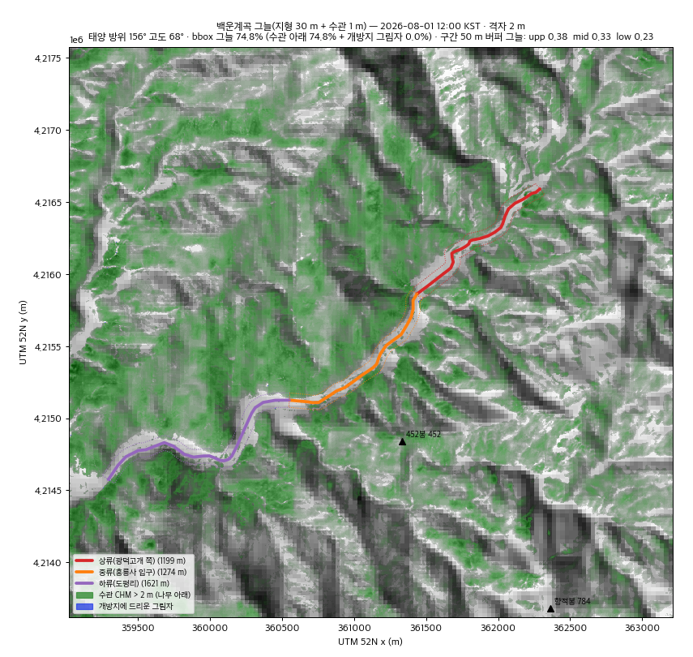
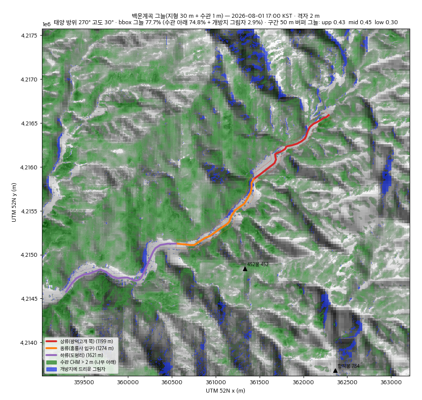
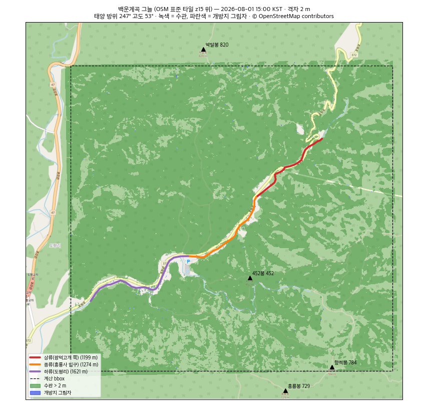

# R3c — 그늘 시험 계산 2 (포천 백운계곡, 지형 30 m + 수관 1 m)

`docs/TODO.md` **R3c**. R3b(지형만, 산그늘 18시 이후)에 **Meta/WRI 1 m 수관 높이(CHM)** 를 더해 시간대별 그늘을 계산하고,
D6 스키마(안)의 값 — `shadeByHour`, `canopyCover`, 시각별 그늘 폴리곤 — 을 실제로 뽑아 품질·계산 비용을 판정한다.
R3b 코드(DEM 재투영·지평선 각도·구간 절단·태양 위치·시각화)를 그대로 import 해 쓰고, 산출물은 `out/canopy/` 에 둔다(R3b 결과는 그대로).
연구 스크립트이며 앱 코드가 아니다(`biome.json` 이 `scripts/research` 를 제외).

## 판정 요약

**진행 가능 — 스키마를 아래 권고대로 확정하고 P1 으로 간다.** 정오 그늘은 전부 수관(나무 아래)이고 CHM 이 그것을 구간별로 변별한다(50 m 버퍼 0.38 / 0.33 / 0.23, 물가 ±10 m 0.12 / 0.22 / 0.02). 격자·날짜·DSM 보정에 따른 흔들림은 ≤ 0.01 로 구간 차보다 한 자릿수 작다. 계산은 계곡 1개 9시각에 **2 m 격자 4 초**(다운로드 55 MB 30 초 별도), 폴리곤은 "정적 수관 1장 + 시각별 개방지 그림자 9장" 으로 나누면 계곡당 **1.5 MB(gzip 206 KB)**, 구간 회랑(±200 m)으로 자르면 **205 KB(gzip 28 KB)** 다.

| 기준 | 결과 | 판정 |
| --- | --- | --- |
| ① 구간 간 `shadeByHour` 변별 — 정오 값 차 ≥ 0.15 | 50 m 버퍼 정오: 상 **0.381** · 중 **0.334** · 하 **0.227** → 상−하 **0.154** ✓, 중−하 0.107, 상−중 0.047. 물가 ±10 m: 0.122 · 0.222 · 0.021 → 중−하 **0.201** ✓, 상−하 0.101, 상−중 0.100. 25 m: 0.230 · 0.280 · 0.116 → 중−하 0.164 ✓. 격자(1 m↔2 m) 차 정오 ≤ 0.002, 날짜(7/25↔8/15) 차 정오 ≤ 0.001·16시 ≤ 0.007, DSM 보정 유무 정오 ≤ 0.001 — **정오 구간 차가 오차의 20배 이상** | **조건부 합격** — 세 쌍 중 한 쌍만 0.15 를 넘지만 0.05~0.10 차이도 통계적으로 실재. 임계 0.15 는 "3단계 표시가 갈리는가" 로 읽어야 한다(아래 권고) |
| ② `canopyCover` 가 정사영상/OSM 임상과 맞는가 | 정사영상은 K1(키) 미확보로 생략. OSM 표준 타일과 눈 대조: CHM 개방지(≤ 2 m)가 **372번 도로·하천 회랑·흥룡사 입구 주차장·도평리 마을** 과 정합(`quicklook-osm-0801-15.png`). OSM `landuse=forest` 는 계곡 바닥까지 통째로 덮는 대형 multipolygon 이라 50 m 버퍼 검증엔 굵다(relation 지오메트리도 Overpass 가 504). bbox 전체 CHM > 2 m 비율 0.748 — 경기 북부 산지로 타당 | **합격(눈 대조)** — 정사영상 대조는 K1 이후 |
| ③ 폴리곤 크기 — 계곡 1개 × 9시각 | 2 m 격자, 단순화 2 m, 최소 25 m²: **합성 9장 5.7 MB(gzip 910 KB, 정점 237k)** — 크다. **분리형**(수관 1장 606 KB + 개방지 그림자 9장 928 KB) **1.5 MB(gzip 206 KB, 정점 53k)**, 그 중 11~14시 그림자 파일은 **0 KB**(비어 있음). **회랑(±200 m) 절단** 시 205 KB(gzip 28 KB, 정점 6.7k) | **합격(분리형·회랑)** — 합성 9장은 불채택 |
| ④ 계산 비용 — 계곡 30~50개 × 9시각 배치 | 2 m: 적재 0.2 s, 시각당 지형 30 m 0.25 s + 그림자 전파 0.03 s → **9시각 2.5 s**, 폴리곤(분리형 1 톨러런스) ≈ 2 s, RSS 405 MB. 1 m: 9시각 8 s + 폴리곤 12 s, RSS 1.1 GB. CHM 다운로드 **54.5 MB / 28 s**(HTTP 6회, 680 MB 타일 중 8 %), GLO-30 46 MB/타일(계곡 여럿이 공유). → 계곡당 **≈ 35 s(대부분 네트워크)**, 50계곡 ≈ 30 분, 2.7 GB 다운로드 | **합격** |
| ⑤ CHM 결측·구름·수면 오분류 | 결측(255)·nodata **0 셀**, `.msk` 창은 전부 0(플래그 없음). 촬영 **2016-12 · 2018-03**(겨울·이른 봄 = 낙엽 시기 → 활엽 수관 과소 가능). 도로(OSM highway ±3 m) 위 CHM > 2 m **20 %**, > 5 m 14 % — 가로수·수관 돌출 + 오분류 상한. 하천 라인 ±10 m 의 CHM 0 비율 63~93 % (물·자갈밭이 0 으로 잘 잡힘, "물 위에 나무" 오분류 징후 없음). 최대 높이 27 m(과소 편향은 Meta 논문의 알려진 한계) | **합격(경고 포함)** — 화면 고지 필요 |

## 방법

- **대상·구간·bbox**: R3b 와 동일 — OSM way 531287119, bbox `127.393~127.440E, 38.060~38.095N`(4.19 × 3.95 km), 구간 `baegun-upper/middle/lower`(`out/segments.geojson`).
- **CHM**: `dataforgood-fb-data/forests/v1/alsgedi_global_v6_float/chm/132110303.tif` — bbox 모서리 4점이 모두 이 z9 quadkey 안(이웃 타일 불필요). 파일은 COG 가 아닌 **스트립 TIFF**(65536 × 65536, uint8 m, 1행 블록, deflate, 오버뷰 없음, EPSG:3857 1.19 m). rasterio + GDAL vsicurl 로 bbox + 250 m 창(4799 × 4563)만 범위 요청 → 헤더 4 MB + 연속 범위 4회 50 MB = **54.5 MB, 28 s**. `CHM_acquisition_date.tif`(0.01°) 창 → 연도 소수 16.92·18.17 = **2016-12 · 2018-03**. `msk/132110303.tif.msk` 창은 전부 0.
- **격자**: UTM 52N **2 m**(기본) 과 1 m(비교), bbox + 200 m 여유(bbox 밖 caster). CHM 은 nearest, GLO-30 은 bilinear 로 올림.
- **지반 보정**: GLO-30 은 DSM(수관 포함 표면)이라 CHM 을 그대로 얹으면 수관이 두 번 들어간다 → **지반 ≈ GLO-30 − CHM 의 30 m 블록 평균**, 표면 = 지반 + CHM(1 m). 보정 없는 GLO-30 + CHM 을 `naive` 변형으로 함께 계산 — 차이는 15시까지 ≤ 0.004, 16시 ≤ 0.015, 18시 0.04~0.08(늦은 오후 그림자가 보정 없이 더 길다).
- **그늘 판정** (셀 x, 시각 t): (a) CHM(x) > **2 m** — 나무 아래, 시각 무관 · (b) 그림자 전파 `H(x) > z(x) + 0.1 m` — 태양 반대 방향으로 스캔라인 O(N) 전파 `H = max(z, H_prev − step·tan(el))`, 열 이동은 누적 오프셋의 정수 차분(Bresenham; 선형 보간은 좁은 물체 그림자를 감쇠시켜 불채택). 사거리 제한 없음(격자 안 지형 자기그림자 포함) · (c) R3b 30 m 지형 마스크(6 km 지평선) OR. 합성 검증: 평지 10 m 기둥·el 45° 에서 8방위 모두 그림자 방향 오차 ≤ 2°, 길이 8.9~9.9 m.
- **구간 집계**: 라인 버퍼 반폭 **50 m**(D6 안) · **25 m** · **10 m**(OSM 에 이 하천의 물 폴리곤이 없어 라인 ±10 m 로 물가 근사) 세 가지. `shadeByHour` = 버퍼 셀 중 그늘 셀 비율, `canopyCover` = 버퍼 셀 중 CHM > 2 m 비율(1·3·5 m 임계도 기록), `openShaded` = 개방지(CHM ≤ 2 m) 셀 중 그림자 비율.
- **시각**: 2026-08-01 KST 10~18 정시 9개(폴리곤·PNG), 7/25·8/15 민감도(구간 값만).
- **폴리곤**: 3×3 닫힘→열림으로 1셀 노이즈 제거 → `rasterio.features.shapes`(4-연결) → 25 m² 미만 제거 → `simplify(tol, preserve_topology)` → WGS84 `[lng, lat]` 소수 5자리. 톨러런스 0·1·2·4 m, 범위 bbox 전체 / 구간 회랑(±200 m), 방식 합성(시각별 전체 그늘 9장) / 분리형(수관 1장 + 시각별 개방지 그림자 9장) 을 모두 재 gzip 크기까지 기록(`out/canopy/polygon-sizes-{1,2}m.json`).

### 태양 위치 (2026-08-01, bbox 중심, KST) 와 bbox 그늘 구성 (2 m)

| 시각 | 방위 / 고도 | bbox 그늘 | 수관 아래 | 개방지 그림자(나무·근거리 지형) | 원거리 지형만 | 개방지 셀 중 그늘 |
| --- | --- | --- | --- | --- | --- | --- |
| 10:00 | 109° / 50° | 75.0 % | 74.8 % | 0.24 % | 0 | 0.9 % |
| 11:00 | 127° / 61° | 74.8 % | 74.8 % | 0.02 % | 0 | 0.1 % |
| 12:00 | 156° / 68° | 74.8 % | 74.8 % | 0.00 % | 0 | 0.0 % |
| 13:00 | 196° / 69° | 74.8 % | 74.8 % | 0.00 % | 0 | 0.0 % |
| 14:00 | 228° / 63° | 74.8 % | 74.8 % | 0.01 % | 0 | 0.0 % |
| 15:00 | 247° / 53° | 74.9 % | 74.8 % | 0.09 % | 0 | 0.3 % |
| 16:00 | 260° / 42° | 75.5 % | 74.8 % | 0.70 % | 0.01 % | 2.8 % |
| 17:00 | 270° / 30° | 77.7 % | 74.8 % | 2.7 % | 0.14 % | 11.4 % |
| 18:00 | 279° / 18° | 82.6 % | 74.8 % | 7.6 % | 0.19 % | 30.7 % |

읽기: 11~15시 그늘은 **수관 그 자체**다 — 개방지(하천·자갈밭·도로)에 드리우는 나무 그림자는 태양 고도 50° 이상에서 수관 가장자리 몇 m 에 그친다(CHM 가장자리가 2~4 m 로 완만해 더 짧다). 개방지가 그늘로 덮이기 시작하는 건 17시(11 %)·18시(31 %).

## 결과 — 구간별 (2026-08-01, 2 m 격자, `out/canopy/result-2m.json`)

`canopyCover`(시각 무관):

| 구간 | 길이 | 50 m: cover / 평균 CHM / CHM=0 | 25 m | 10 m(물가) | 50 m 임계 1·3·5 m |
| --- | --- | --- | --- | --- | --- |
| 상류(광덕고개 쪽) | 1,199 m | **0.381** / 3.2 m / 53 % | 0.230 | 0.122 | 0.419 · 0.345 · 0.273 |
| 중류(흥룡사 입구) | 1,274 m | **0.334** / 2.8 m / 54 % | 0.280 | 0.223 | 0.388 · 0.287 · 0.213 |
| 하류(도평리) | 1,621 m | **0.227** / 1.7 m / 67 % | 0.116 | 0.021 | 0.266 · 0.195 · 0.134 |

`shadeByHour` (50 m 버퍼 / 물가 10 m):

| 구간 | 10 | 11 | 12 | 13 | 14 | 15 | 16 | 17 | 18 |
| --- | --- | --- | --- | --- | --- | --- | --- | --- | --- |
| 상류 50 m | .394 | .384 | .382 | .381 | .381 | .383 | .392 | .433 | .617 |
| 중류 50 m | .346 | .337 | .334 | .334 | .335 | .341 | .363 | .451 | .787 |
| 하류 50 m | .238 | .229 | .228 | .227 | .228 | .233 | .247 | .301 | .597 |
| 상류 10 m | .134 | .125 | .123 | .123 | .122 | .123 | .128 | .155 | .514 |
| 중류 10 m | .238 | .227 | .224 | .223 | .223 | .226 | .235 | .320 | .727 |
| 하류 10 m | .024 | .021 | .021 | .021 | .021 | .022 | .025 | .077 | .422 |

개방지 셀 중 그늘(50 m 버퍼, "물가 자갈밭에 서 있을 때"): 세 구간 모두 11~14시 **≤ 0.3 %**, 15시 ≤ 1.1 %, 16시 2~4 %, 17시 8~18 %, 18시 38~68 %.

민감도(50 m, 정오 / 18시): 7/25 → .381/.591 · .334/.769 · .227/.571, 8/15 → .382/.684 · .335/.828 · .228/.675. 정오는 날짜 무관, 18시는 8월 중순이 0.08~0.10 높다(태양 고도 15° vs 19°). 1 m 격자와의 차: 정오 ≤ 0.002, 17시 ≤ 0.014.

**해석.** ① 10~16시 `shadeByHour` 는 사실상 `canopyCover` 와 같은 값(차 ≤ 0.01)이고 17·18시에만 갈린다 — 배열 9개 중 정보는 "수관 비율 1개 + 늦은 오후 2개". ② 상류는 50 m 에서 가장 짙지만 물가 10 m 에서는 중류가 짙다 — 상류의 나무는 사면(도로 반대편)에, 중류의 나무는 물가에 붙어 있다. 사용자가 서는 곳은 물가이므로 **버퍼 반폭이 결과의 의미를 바꾼다**. ③ 하류(도평리)는 어느 정의로도 개방(마을·논).

## 폴리곤 크기 (계곡 1개, 2 m 격자, 최소 25 m², `polygon-sizes-2m.json`)

| 톨러런스 | 합성 9장 raw / gzip / 정점 | 분리형 bbox (수관 1 + 그림자 9) | 분리형 회랑 ±200 m | 폴리곤화 시간 |
| --- | --- | --- | --- | --- |
| 0 m | 14.0 MB / 1.7 MB / 648k | 3.1 MB / 363 KB / 132k | 470 KB / 55 KB / 20k | 5.4 s |
| 1 m | 11.7 MB / 1.6 MB / 533k | 2.7 MB / 329 KB / 110k | 396 KB / 50 KB / 16k | 6.3 s |
| **2 m** | 5.7 MB / 910 KB / 237k | **1.5 MB / 206 KB / 53k** | **205 KB / 28 KB / 6.7k** | 4.9 s |
| 4 m | 3.9 MB / 620 KB / 148k | 1.2 MB / 152 KB / 36k | 160 KB / 20 KB / 4.5k | 4.4 s |

분리형 bbox, 2 m 톨러런스의 시각별 그림자 파일: 10시 31 KB(692 정점) · **11~14시 0 KB** · 15시 4 KB · 16시 98 KB · 17시 318 KB · 18시 474 KB. 수관 1장 606 KB(26.9k 정점, 441 폴리곤). 1 m 격자는 같은 조건에서 분리형 bbox 2.7 MB(정점 83k) 로 1.7배.
커밋한 것: `canopy-gt2m.geojson` + `cast-0801-<HH>.geojson`(분리형 bbox, 2 m). 합성 9장(`shade-0801-<HH>.geojson`, 5.7 MB)은 `.gitignore`(31 s 에 재생성).

## 시각화 (`out/canopy/*.png`, 2 m 격자)

GLO-30 음영기복 + **녹색 = CHM > 2 m(나무 아래)** + **파란색 = 개방지에 드리운 그림자** + 구간 3색(점선 = 50 m 버퍼). 12·15시는 파란색이 거의 없고(수관만), 17시에 능선 동사면과 물가에 그림자가 나타난다.

| 12:00 | 15:00 | 17:00 |
| --- | --- | --- |
|  |  |  |

OSM 표준 타일(z15, © OpenStreetMap contributors) 위 15시 겹침 — 개방지가 372번 도로·하천 회랑·흥룡사 입구 주차장·도평리와 정합:



## 스키마 확정 (→ P1)

**사용자 확정 2026-09-03** — 아래 권고를 그대로 채택: 버퍼 반폭 **25 m**, 폴리곤 **분리형**(수관 1장 + 시각별 개방지 그림자 9장, 회랑 ±200 m), **`shadeRatio` 제거** → 정오 값은 `shadeByHour[2]`, 나무 밀도는 `canopyCover`. 격자 2 m. P1 은 이 절을 사양으로 구현한다(`Segment.ts` 의 `shadeRatio` → `shadeByHour`·`canopyCover`, 로더 검증 길이 9·각 0~1, 예제 데이터·테스트 갱신 포함).


1. **`segmentProps.shadeByHour: number[9]`** — KST 10~18 정시, 대표일 **8/1**, 값 0~1 소수 2자리. 9개 중 10~16시가 거의 같은 값이지만 F4 시간 슬라이더(9 스톱)와 폴리곤 파일이 같은 인덱스를 쓰도록 **9개 유지**. 대안(6개: 10·12·14·16·17·18)은 슬라이더와 어긋나 불채택.
2. **버퍼 반폭 25 m 로 계산** — `shadeByHour`·`canopyCover` 둘 다. 50 m 는 사면 나무를 세어 "물가 그늘"과 어긋나고(상류↔중류 순위 역전), 10 m 는 OSM 하천 라인 위치 오차(5~10 m)에 그대로 노출된다. 25 m 는 물 + 양안 자갈밭을 덮고 라인 오차에 견디며 변별력(정오 0.23/0.28/0.12)도 유지. D6 안의 50 m 는 `canopyCover` 보조값으로도 두지 않는다(필드 하나 = 정의 하나).
3. **`shadeRatio` 제거.** 정오 값은 `shadeByHour[2]` 이고 그 값은 `canopyCover` 와 0.01 안에서 같다. 카드 표시가 필요하면 표현 계층이 `shadeByHour[2]` 를 읽는다.
4. **`segmentProps.canopyCover: number`** — 버퍼(25 m) 안 CHM > **2 m** 비율. 임계 1·3·5 m 로 바꿔도 구간 순위는 그대로(위 표)이고, 2 m 는 "머리 위에 무언가 있다" 의 하한. 3단계 표시 임계(표현 계층): **`dense ≥ 0.5`, `moderate 0.25~0.5`, `sparse < 0.25`** — 백운은 25 m 기준 상 0.23 sparse · 중 0.28 moderate · 하 0.12 sparse. 다른 계곡 5~10개를 돌려 분포를 본 뒤 조정(P1 산출물로 히스토그램).
5. **폴리곤 파일 규약 — 분리형**: `data/shade/<valleyId>/canopy.geojson`(정적, CHM > 2 m) + `data/shade/<valleyId>/cast-<HH>.geojson`(HH = 10..18, 개방지 그림자 = 시각 t 그늘 − 수관). F4 는 `canopy` 를 항상 그리고 슬라이더 시각의 `cast-<HH>` 를 겹친다. 좌표 `[lng, lat]` 소수 5자리, WGS84, **격자 2 m, 단순화 2 m(preserve_topology), 최소 면적 25 m², 3×3 닫힘→열림**, 범위 = **구간 회랑 ±200 m**(bbox 전체가 아니라). 계곡당 ≈ 200 KB(gzip 28 KB). Feature `properties`: `{ valleyId, layer: 'canopy'|'cast', date, timeLocal? }`. 계곡 bbox 전체가 필요해지면(지도 줌아웃) 같은 규약으로 `scope: 'bbox'` 만 바꾼다(1.5 MB).
6. **격자 2 m.** 1 m 대비 `shadeByHour` 차 ≤ 0.014, `canopyCover` 차 ≤ 0.001, 계산 4배·메모리 2.7배·폴리곤 1.7배 절약.
7. **`terrainShadeFromLocal` 불필요**(D6 그대로) — `cast-17/18` 이 그 정보를 담는다.
8. **화면 고지**: "위성 기반 추정(수관 2016~2018 겨울 영상, 지형 30 m) — 현장과 다를 수 있음". 겨울 영상이라 활엽 수관은 과소 추정될 수 있다(그늘이 실제보다 적게 나오는 방향).

### P1 이 그대로 구현할 함수 (파이썬, `scripts/shade/`)

```python
def fetch_chm_window(bbox: tuple[float, float, float, float], margin_m: float = 250, cache_dir: Path) -> Path:
    """bbox(WGS84 w,s,e,n) 를 덮는 z9 quadkey 들(모서리 4점 → 보통 1개, 경계면 2~4개)의 CHM 을 창 읽기해 EPSG:3857 GeoTIFF 로 저장.
    스트립 TIFF 라 행 범위 연속 요청 — 계곡 4 × 4 km 에 ~55 MB. 반환: 병합된 로컬 tif."""

def build_grid(bbox, chm_3857: Path, dem_30m: Path, res_m: int = 2, margin_m: float = 200) -> Grid:
    """UTM 존 자동 선택(bbox 중심 경도) 후 CHM(nearest)·DSM(bilinear)·보정 지반(DSM − 30 m 평균 CHM) 을 같은 격자에.
    Grid: chm, dsm, ground, transform, core(slice) — canopy/shade_canopy.Grid 와 동일."""

def shade_mask(grid: Grid, dem_30m: Dem, when: datetime, canopy_threshold_m: float = 2.0) -> tuple[np.ndarray, np.ndarray]:
    """(shade, under) — shade = under | cast_shadow_height(ground+chm, res, az, el) > surface + 0.1 | terrain30(when).
    cast_shadow_height 는 canopy/shade_canopy.cast_shadow_height 그대로(O(N) 스캔라인, Bresenham 열 이동)."""

def segment_props(grid: Grid, segments: list[tuple[dict, LineString]], shades: dict[str, np.ndarray], under: np.ndarray, buffer_half_m: float = 25.0) -> dict[str, dict]:
    """{segmentId: {"canopyCover": float, "shadeByHour": list[float]  # HOURS 순}} — 버퍼 래스터화 후 mean."""

def write_shade_layers(grid: Grid, shades: dict[str, np.ndarray], under: np.ndarray, corridor: np.ndarray, valley_id: str, out_dir: Path,
                       tol_m: float = 2.0, min_area_m2: float = 25.0, decimals: int = 5) -> dict[str, int]:
    """data/shade/<valleyId>/canopy.geojson + cast-<HH>.geojson. clean_mask(3×3) → shapes → 면적 필터 → simplify → WGS84 → 반올림.
    반환: 파일별 바이트(빌드 로그·회귀 확인용)."""

HOURS = [f"{h:02d}:00" for h in range(10, 19)]   # KST, 대표일 "2026-08-01" 은 valley-ds 상수로
```

- `Dem`(30 m 지평선), `sun_position`(astral) 은 R3b `shade.py` 에서, `cast_shadow_height`·`clean_mask`·`polygonize`·`Grid.corrected_ground` 는 이 패키지에서 옮긴다.
- GLO-30 타일은 1° 단위라 계곡 여럿이 한 타일을 공유 — 타일 캐시 필수. bbox 가 타일·quadkey 경계에 걸치면 이웃도 읽어 병합(`rasterio.merge`).
- 배치 비용 추정: 계곡당 CHM 55 MB/30 s + 계산 3 s + 폴리곤 2 s ≈ 35 s, 50계곡 30 분·2.7 GB. GitHub Actions 무료 러너로 충분.

## 알려진 한계

- **CHM 은 2016-12·2018-03 스냅샷**(이 bbox), 겨울 영상. 벌채·생장·낙엽 미반영, MAE 2.8 m, 최대 27 m 로 큰 나무 과소. 도로 위 20 % 가 > 2 m — 가로수 실제 + 오분류 상한.
- **GLO-30 은 DSM** — 지반 보정(30 m 평균 CHM 차감)은 근사. 1 m bilinear 표면은 30 m 셀 경계에서 기울기가 불연속이라 저고도(17~18시) 지형 자기그림자에 격자 무늬가 섞인다. 국토지리정보원 5 m DEM 이 있으면 대체.
- **물 폴리곤 없음** — OSM 에 이 하천은 라인만. 물가 정의는 라인 버퍼로 근사. 하천 라인 위치 오차 5~10 m.
- 정사영상 대조 미실시(K1). 태양 위치는 bbox 중심 1점(4 km 안에서 방위 차 < 0.1°).

## 실행

```bash
cd scripts/research/shade-pilot
# R3b 환경·산출물(out/dem_utm.tif, out/segments.geojson)이 먼저 있어야 한다: README.md 의 run_all.sh
.venv/bin/python -m canopy.fetch_osm_extra          # OSM 물·임상·도로 (선택; 없으면 ② ⑤ 대조 항목만 빈다)
RES=2 canopy/run_all.sh                             # fetch_chm(S3 55 MB) → shade_canopy --sens → quicklook  (≈ 1.5 분)
RES=1 canopy/run_all.sh --offline                   # 1 m 비교 (CHM 재요청 없음, ≈ 2 분, RSS 1.1 GB)
```

- `canopy/settings.py` — R3b `config` 를 물려받고 CHM URL·격자·버퍼·시각·폴리곤 파라미터.
- `canopy/fetch_chm.py` — S3 창 읽기(바이트·요청 수 집계), 촬영일·마스크, UTM 1 m/2 m 재투영 → `out/canopy/chm-meta.json`.
- `canopy/shade_canopy.py` — 그늘 계산·구간 집계·폴리곤(크기 표) → `result-<res>m.json`, `polygon-sizes-<res>m.json`, `canopy-gt2m.geojson`, `cast-0801-<HH>.geojson`, `shade-0801-<HH>.geojson`(미커밋), `masks-<res>m.npz`(미커밋).
- `canopy/quicklook_canopy.py` — PNG 4장.
- `canopy/fetch_osm_extra.py` — Overpass 보조 질의 → `data/overpass_extra.json`.
- 환경은 R3b 와 같다(numpy 2.0.2 · rasterio 1.4.3 · shapely 2.0.7 · pyproj 3.6.1 · astral 3.2 · matplotlib 3.9.4, Python 3.9). 추가 의존성 없음.
- 커밋 제외: `data/`(CHM 창 2.4 MB tif, DEM, overpass), `out/canopy/*.npz`, `out/canopy/shade-0801-*.geojson`.

## 데이터 출처·라이선스

- Meta/WRI **Global Canopy Height Map v1** (Tolan et al. 2024) — CC-BY 4.0, `s3://dataforgood-fb-data/forests/v1/alsgedi_global_v6_float/`.
- Copernicus DEM GLO-30 — Copernicus DEM Licence (R3b 와 동일).
- OpenStreetMap(하천·도로·임상·표준 타일) — © OpenStreetMap contributors, ODbL 1.0.
- 태양 위치 — `astral` 3.2 (Apache-2.0).
